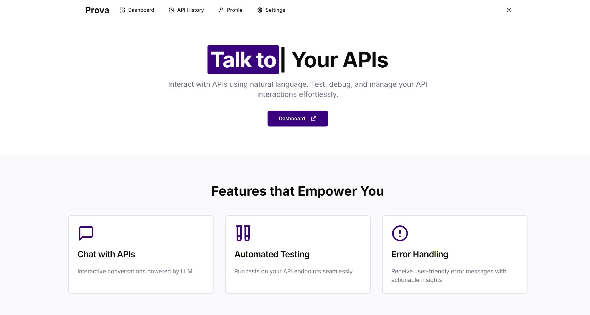
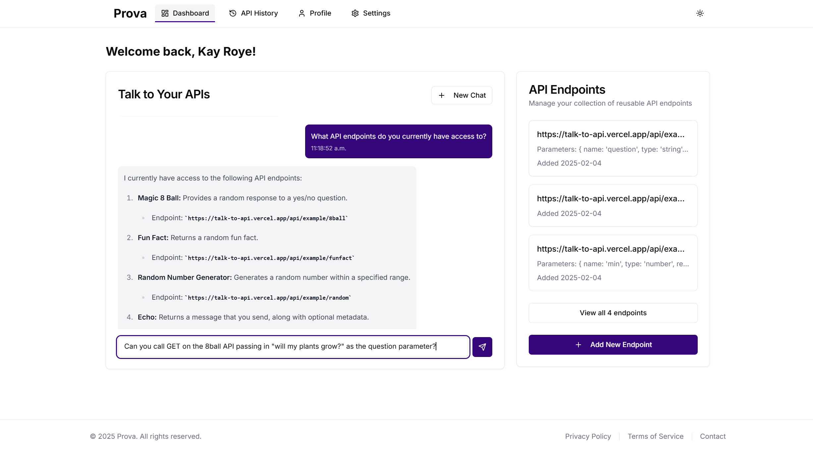
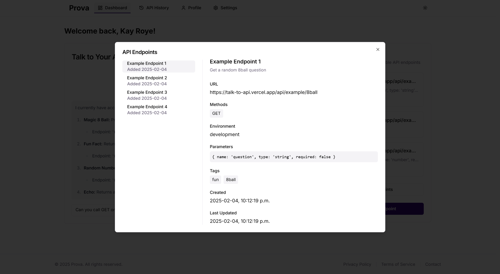
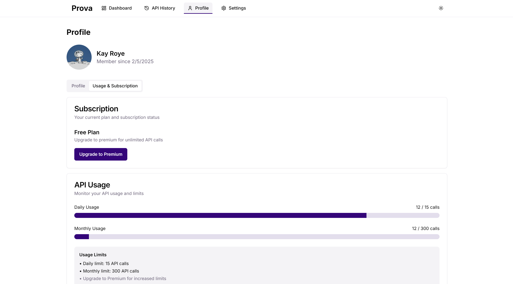

<div align="center">

# Prova
### API Interaction Made Natural

A modern web application that allows users to interact with APIs through natural language conversations. Built with Next.js and powered by AI, this platform makes API interaction intuitive and accessible.

[Demo](https://talk-to-api.vercel.app) · [Bug Report](https://github.com/kayroye/prova/issues)


</div>

## 📸 Screenshots

### Landing Page


### Dashboard & Chat Interface

*Interactive chat interface with API integration*

### API Management

*Add and manage your API endpoints*

### Profile & Usage Stats

*User profile and usage statistics*

## ✨ Features

<details>
<summary>🔐 Authentication & Security</summary>

- Multiple sign-in options (Email/Password, Google, GitHub)
- Multi-factor authentication (MFA) with backup codes
- Secure password reset functionality
- Session persistence across page reloads
</details>

<details>
<summary>🔌 API Management</summary>

- Add and manage custom API endpoints
- Store and organize API configurations
- View API call history and logs
- Parameter management for API endpoints
</details>

<details>
<summary>🤖 AI-Powered Chat Interface</summary>

- Natural language interaction with APIs
- Context-aware conversations
- Real-time API response interpretation
- Markdown support for formatted responses
</details>

<details>
<summary>👥 User Management</summary>

- User profiles with customizable settings
- Role-based access control (Free/Premium tiers)
- Usage tracking and rate limiting
- Subscription management
</details>

## 🛠️ Tech Stack

- **Frontend**: Next.js 15, React 19, Tailwind CSS, shadcn/ui
- **Backend**: Next.js API Routes, Supabase (PostgreSQL)
- **Authentication**: NextAuth.js, Supabase Auth
- **AI Integration**: OpenAI SDK with function calling

## 🚀 Getting Started

### Prerequisites

- Node.js 18+
- npm/yarn/pnpm
- Supabase account
- OpenAI API key

### Installation

1. Clone the repository

```bash
git clone https://github.com/kayroye/prova.git
```

2. Install dependencies
```bash
cd prova
npm install
```

3. Set up environment variables
```bash
cp .env.example .env.local
```

Fill in your environment variables:
```bash
NEXT_PUBLIC_SUPABASE_URL=your_supabase_url
NEXT_PUBLIC_SUPABASE_ANON_KEY=your_supabase_anon_key
OPEN_AI_API_KEY=your_openai_key
GOOGLE_CLIENT_ID=your_google_client_id
GOOGLE_CLIENT_SECRET=your_google_client_secret
GITHUB_CLIENT_ID=your_github_client_id
GITHUB_CLIENT_SECRET=your_github_client_secret
NEXTAUTH_SECRET=a_nextauth_secret
```

4. Run the development server
```bash
npm run dev
```

Visit [http://localhost:3000](http://localhost:3000) to see the application.

## 📄 License

This project is licensed under the MIT License - see the [LICENSE](LICENSE) file for details.

## Acknowledgments

- [Shadcn UI](https://ui.shadcn.com) for the components
- [OpenAI](https://openai.com) for the AI capabilities
- [Supabase](https://supabase.com) for the backend infrastructure
